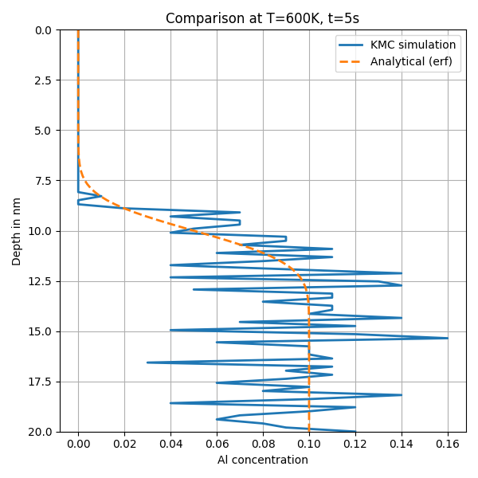
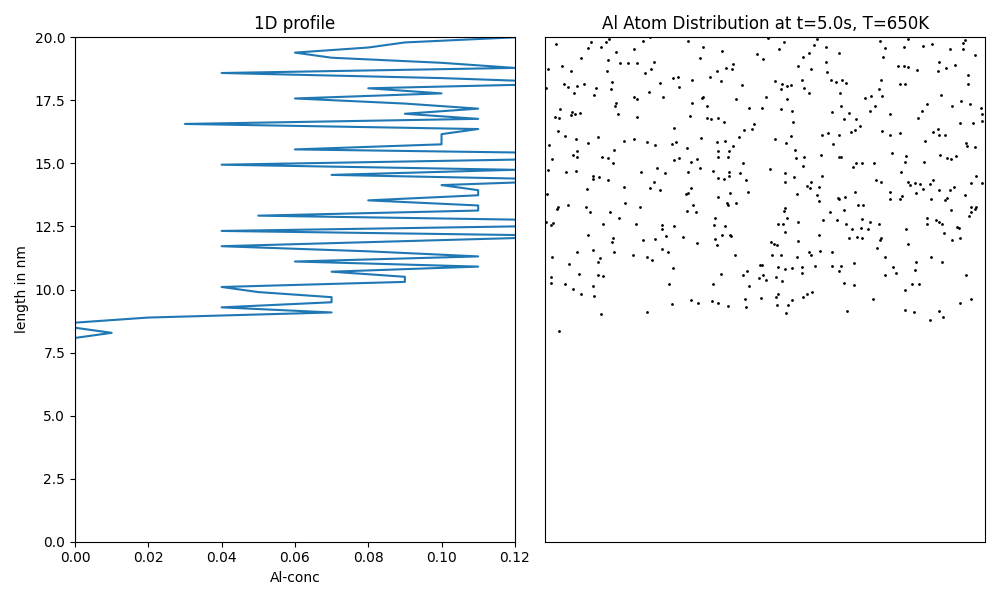
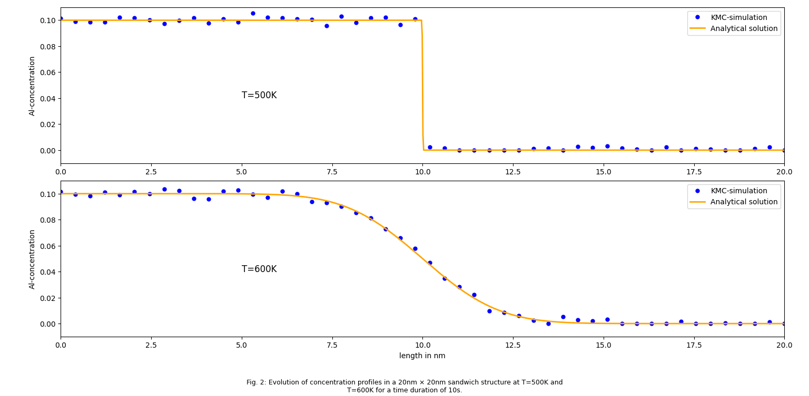

# Kinetic Monte Carlo Simulation of Al Diffusion in Cu

This project models the diffusion of Aluminum (Al) atoms in a Copper (Cu) thin film using both:

- Atomistic Kinetic Monte Carlo (KMC) simulation
- Coarse-Grained diffusion modeling

It compares the simulation results with analytical solutions based on the error function.

---

## 📁 Contents

- `KMC_2.1 and 2.2.py` – Python code implementing KMC and coarse-grained simulations
- `KMC_report.pdf` – Final project report
- `KMC.pdf` – Original assignment sheet
- Images (see below) for visualizing simulation results

---

## 🔬 Method Overview

### 1. Atomistic KMC (Task 2.1)
- 2D lattice simulation of Al atoms jumping between substitutional sites
- Temperature-dependent jump frequency
- Time-advancing stochastic algorithm

### 2. Coarse-Grained Model (Task 2.2)
- Film divided into discrete cells (each representing multiple atoms)
- Finite difference approach for inter-cell diffusion
- Computationally efficient for long-time simulation

---

## 📊 Simulation Results

### 📌 Analytical vs KMC at 700K, Long-Time Diffusion


### 📌 KMC vs Analytical Profile at 600K, 5s Duration


### 📌 Evolution at 500K and 600K in 20nm × 20nm Sandwich


### 📌 Final Al Distribution at T=650K, t=5s


---

## 🚀 How to Run

1. **Install dependencies**:
```bash
pip install numpy matplotlib scipy

2. **Run the simulation**:
```bash
python "KMC_2.1 and 2.2.py"

